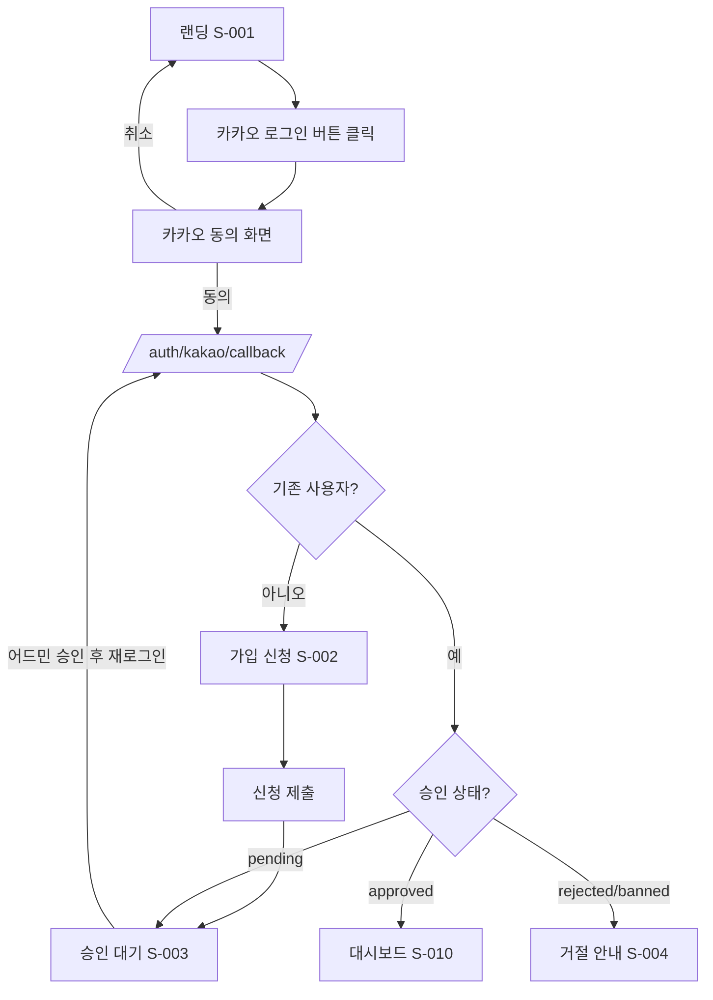
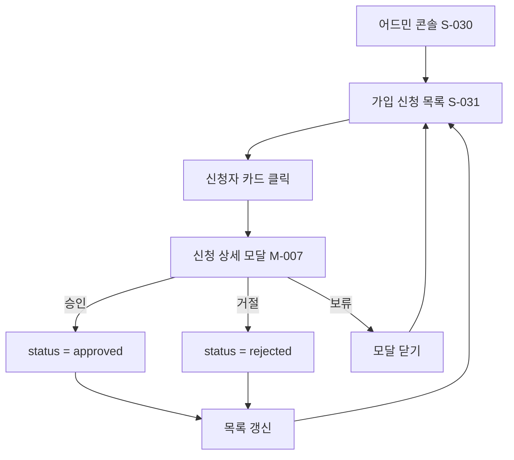
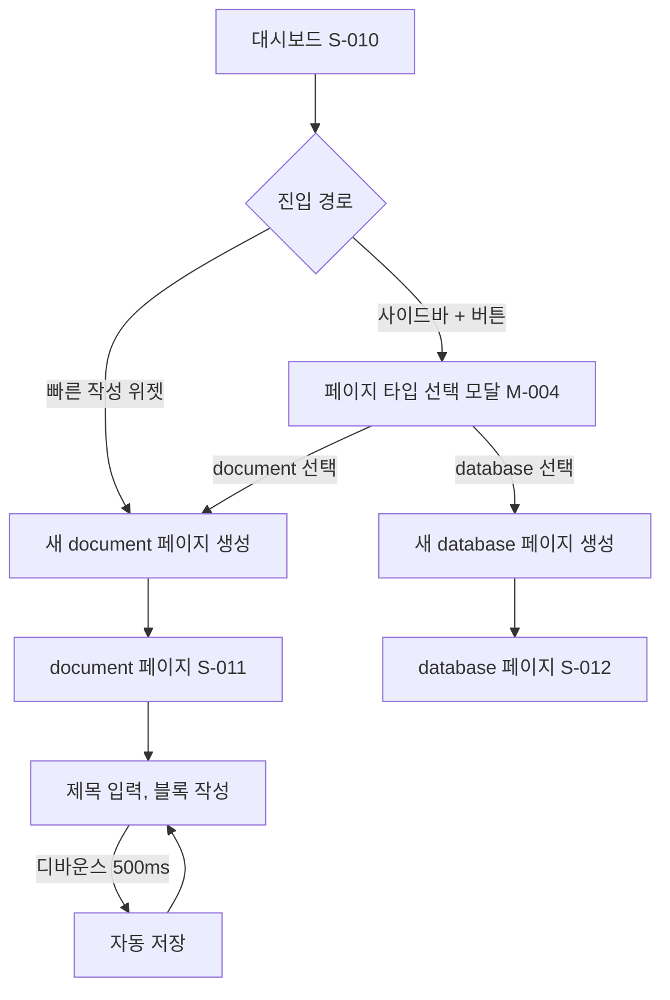
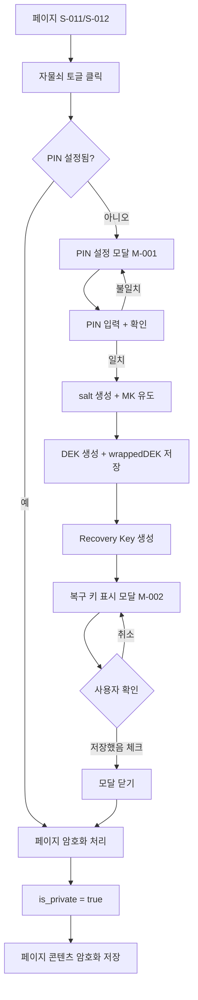
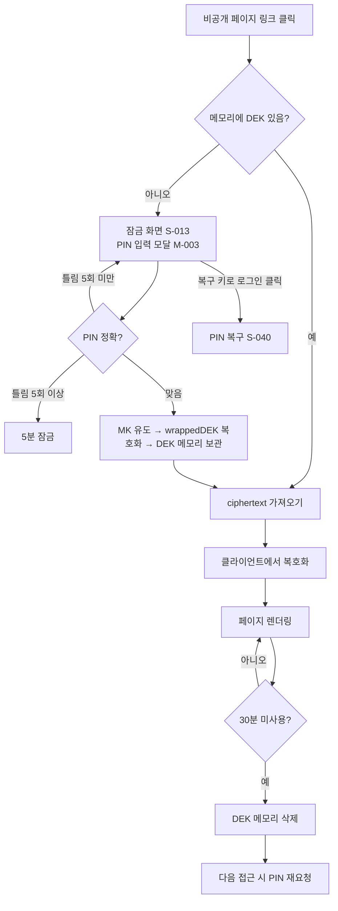
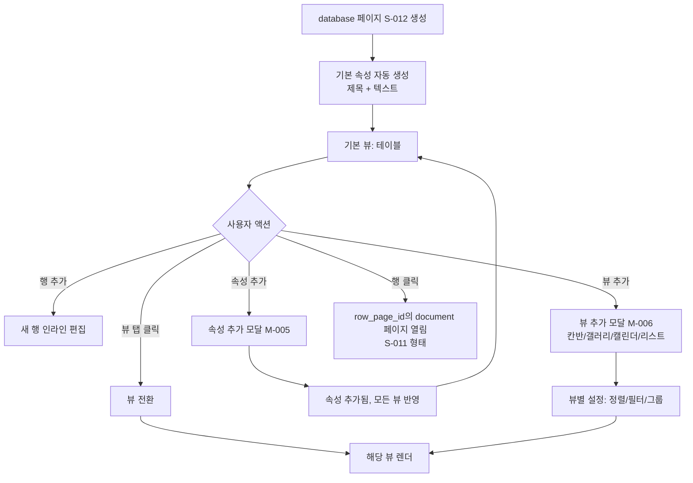
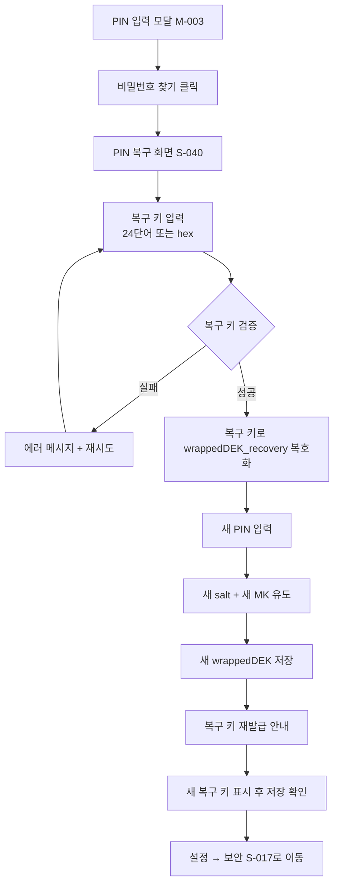
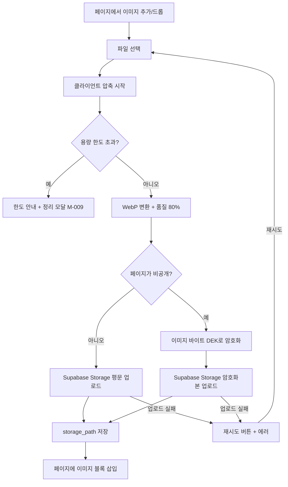

# younest — Product Requirements Document (PRD) v0.3

> **작성일**: 2026-05-12  
> **버전**: v0.3 (사용자 플로우 + 화면 목록 추가)  
> **이전 버전**: v0.2  
> **제품명**: younest (유네스트)  
> **한 줄 설명**: 노션의 핵심 기능을 무료·무제한으로, 민감한 노트는 본인만 볼 수 있게 암호화한 개인용 워크스페이스.

### v0.2 → v0.3 주요 변경
1. **§11 사용자 플로우 다이어그램 8종 추가** (Mermaid)
2. **§12 화면 목록(Screen Inventory) 23개 + 모달 9개 추가**
3. **§12.4 Next.js App Router 폴더 구조** 제안
4. 화면 ID 체계 도입 (`S-001`, 모달은 `M-001`)
5. KPI 이하 섹션 번호 한 칸씩 밀림

---

## 1. 제품 개요

### 1.1 비전
구독료와 제한에 답답한 사용자들이, 안전하고 부드러운 자기만의 "디지털 둥지"를 갖도록 한다.

### 1.2 어원
**You + Nest** — 너만의 둥지.

### 1.3 차별화 포인트
1. **무료 + 무제한 (개인 한도 내)** — 노션 무료 티어의 블록·페이지 제한 없음
2. **본인만 보는 노트** — 페이지별 E2E 암호화 (어드민도 열람 불가)
3. **국내 사용자 친화** — 카카오 로그인, 한글 우선 UX
4. **불필요한 기능 제거** — AI 등 타겟 유저에게 매력도 낮은 기능 미포함

---

## 2. 배경 및 문제 정의

| 문제 | 영향 |
|---|---|
| 노션 무료 한도(블록·게스트) 도달, 유료 결제 부담 | 일상 기록의 단절 |
| 일기·기도제목 등 사적 콘텐츠를 일반 SaaS에 두기 불안 | 깊이 있는 기록 회피 |
| 노션 AI, 협업 기능 등 1인 사용자에게 과한 번들 | 학습 부담, 인지 과부하 |
| 영문 위주 UX, 결제·로그인 흐름이 국내 사용자에 낯섦 | 진입 장벽 |

---

## 3. 타겟 유저 & 페르소나

**타겟**: 20-30대 여성, 개인 기록·일기·기도제목·일정 관리에 노션을 쓰거나 쓰고 싶은 사용자.

### 페르소나 1 — 주연 (28, 직장인)
- 매일 일기와 기도제목을 적음. 노션 무료 한도 도달.
- 직장 일정과 개인 일정을 한 곳에서 관리하고 싶음.
- **니즈**: 무제한 작성, 절대적 프라이버시.

### 페르소나 2 — 수민 (24, 대학원생)
- 논문 자료·메모·일상 기록을 분리해서 관리.
- 일부 글은 절대 누구도 보지 못해야 함.
- **니즈**: 칸반/데이터베이스, 비공개 페이지.

---

## 4. 범위 (Scope)

### 4.1 In Scope — MVP v1.0
- 카카오 OAuth 로그인
- 어드민 승인 기반 가입
- 블록 에디터 (텍스트, 헤더, 리스트, 토글, 콜아웃, 인용, 코드, 이미지, 구분선, 페이지 링크)
- 페이지 내 페이지 (무제한 중첩)
- 대시보드 (메인 화면)
- **데이터베이스 시스템** (페이지 타입 중 하나)
  - 속성: 텍스트, 선택, 다중선택, 날짜, 체크박스, 숫자, URL
  - 뷰: **테이블 / 칸반 / 갤러리 / 캘린더 / 리스트** (5종)
  - 정렬, 필터, 그룹화 (뷰별 저장)
  - 각 행(row) = 자체 페이지 (노션과 동일 모델)
- 페이지별 비공개 토글 → E2E 암호화
- 이미지 자동 압축 업로드
- PWA (설치 가능, 오프라인 캐시 기본)
- 반응형 (데스크탑/모바일)

### 4.2 Out of Scope — v2 이후
- 협업/공유 기능
- 카카오 외 다른 SNS 로그인
- AI 기능
- 데이터베이스 타임라인 뷰 (간트형)
- 데이터베이스 수식·관계형·롤업 속성
- 노션 가져오기
- 수식 블록 (LaTeX)
- 동기화 블록, 백링크, 템플릿 버튼
- 모바일 푸시 알림

---

## 5. 기능 요구사항

### 5.1 인증 & 가입
- **카카오 OAuth 2.0** 단일 로그인
- 신규 가입 흐름:
  1. 카카오 로그인 버튼 → 카카오 동의 → 콜백
  2. 신규 사용자면 가입 신청 폼 (닉네임, 간단한 사용 목적)
  3. `status = pending` 상태로 저장
  4. 어드민이 어드민 콘솔에서 승인/거절
  5. 승인 후 다음 로그인부터 정상 진입
- 거절된 사용자에게는 안내 화면
- 세션: HttpOnly + Secure + SameSite 쿠키, JWT

### 5.2 어드민 콘솔
- 본인 카카오 ID는 환경변수로 하드코딩하여 자동 어드민 부여
- 기능:
  - 가입 신청 목록 (승인 / 거절 / 보류)
  - 사용자 목록 (비활성화 가능)
  - 가입자 통계 (총 사용자, 활성 사용자, 가입 신청 수)
- **사용자 콘텐츠 열람 불가** (UI 차단 + DB RLS로 강제)

### 5.3 페이지 시스템
- 페이지는 트리 구조 (`parent_page_id`)
- 페이지 타입: `document` (기본 블록 에디터) | `database` (데이터베이스)
- 페이지 메타: 제목, 아이콘(이모지), 커버 이미지, 비공개 플래그, 즐겨찾기 플래그, 생성/수정 시간
- 페이지 내 페이지: 깊이 제한 없음, 사이드바에 인덴트로 표시
- 휴지통: 30일 보관 후 자동 영구 삭제

### 5.4 블록 에디터 (document 타입 페이지)
**기반**: BlockNote (§7.1 참조)

| 블록 | 슬래시 커맨드 | 단축키 (Markdown) |
|---|---|---|
| 텍스트 (paragraph) | `/text` | — |
| 헤더 1/2/3 | `/h1`, `/h2`, `/h3` | `#`, `##`, `###` + space |
| 불릿 리스트 | `/bullet` | `-` + space |
| 번호 리스트 | `/number` | `1.` + space |
| 체크리스트 | `/todo` | `[]` + space |
| 토글 | `/toggle` | `>` + space |
| 콜아웃 | `/callout` | — |
| 인용 | `/quote` | `"` + space |
| 코드 블록 | `/code` | ``` ``` ``` |
| 이미지 | `/image` | 드래그 앤 드롭 |
| 구분선 | `/divider` | `---` |
| 페이지 링크 | `/page` | — |

- 드래그 앤 드롭으로 블록 재정렬
- 다중 선택, 일괄 삭제/복사
- 저장: 디바운스 500ms, 낙관적 업데이트

### 5.5 대시보드
- 메인 진입 화면 (로그인 후 첫 페이지)
- 위젯:
  - 즐겨찾기 페이지 (최대 8개)
  - 최근 수정 페이지 (최대 10개)
  - 빠른 작성 (메모, 일기, 기도제목 템플릿 버튼)

### 5.6 데이터베이스 시스템 (database 타입 페이지)
> 노션의 핵심. 에디터와 **분리된** 별도 시스템 (§7.4 참조).

#### 5.6.1 모델
- 데이터베이스 페이지 = 동일 스키마를 공유하는 페이지(row)들의 집합
- 각 행은 자체 페이지로 확장 가능 (열면 document 에디터)
- 한 데이터베이스에는 여러 뷰가 저장되고 전환 가능

#### 5.6.2 속성 (Property) — MVP 7종
| 속성 | 설명 |
|---|---|
| 제목 (title) | 모든 행 필수, 페이지 제목과 동기화 |
| 텍스트 (text) | 짧은 텍스트 |
| 선택 (select) | 단일 선택, 옵션 관리 |
| 다중선택 (multi-select) | 태그 형태 |
| 날짜 (date) | 일자/시각, 범위 |
| 체크박스 (checkbox) | 불리언 |
| 숫자 (number) | 정수/소수, 단위(통화·퍼센트) |
| URL | 링크, 클릭 시 새 탭 |

> v2 추가 예정: 수식(formula), 관계형(relation), 롤업(rollup), 파일(file), 사람(person)

#### 5.6.3 뷰 (View) — MVP 5종
1. **테이블 (Table)**: 스프레드시트형, 컬럼 = 속성. 인라인 편집.
2. **칸반 (Kanban)**: select 속성을 컬럼으로 그룹화, 카드 드래그 앤 드롭.
3. **갤러리 (Gallery)**: 카드 그리드, 커버 이미지 강조.
4. **캘린더 (Calendar)**: date 속성 기반, 월간 뷰. 클릭 시 행 페이지 열림.
5. **리스트 (List)**: 한 줄 요약형, 모바일 친화.

#### 5.6.4 뷰별 기능
- 정렬: 다중 정렬 키, 오름/내림차순
- 필터: 속성별 조건 (포함, 같음, 비어있지 않음 등), AND/OR
- 그룹화: select/multi-select 기준 (칸반은 필수)
- 보이는 속성 토글
- 뷰 추가/이름변경/삭제, 뷰 간 전환은 탭 형태

#### 5.6.5 모바일 UX
- 테이블은 가로 스크롤
- 칸반은 한 컬럼씩 스와이프
- 캘린더는 주간 뷰로 자동 전환

### 5.7 비공개 페이지 (E2E)
- 페이지 우상단 자물쇠 토글 → "비공개" 전환
- document/database 둘 다 비공개 가능
  - database의 경우: 모든 행 + 속성 값까지 암호화
- 처음 비공개로 만들 때: PIN 설정 안내 (계정 1회 설정)
- 비공개 페이지 열람: PIN 입력 또는 세션 내 유지된 키 사용
- 세션 내 비공개 키 자동 만료: 30분 미사용 시
- 상세는 §8 보안 아키텍처 참조

### 5.8 이미지 업로드
- 클라이언트 사이드 자동 압축 (`browser-image-compression`)
  - 최대 너비 1920px
  - WebP 변환 (브라우저 지원 시)
  - 품질 80%
- 한 번에 다중 업로드 (최대 10장)
- 비공개 페이지의 이미지: 클라이언트 측 AES-GCM 암호화 후 업로드
- 사용자당 총 용량 한도: **초기 100MB** (Supabase 무료 1GB 내 분배)
- 한도 도달 시 안내 + 오래된 이미지 일괄 삭제 화면

### 5.9 검색
- 공개 페이지: 서버 측 PostgreSQL 전문 검색 (`tsvector`)
- 비공개 페이지: 클라이언트 측 검색만 (복호화된 캐시 내에서)
- 데이터베이스 행도 검색 대상에 포함
- 단축키: `Cmd/Ctrl + K`

---

## 6. 비기능 요구사항

### 6.1 성능 목표
- LCP < 2.5초 (3G 모바일 기준)
- 블록 입력 → DB 저장 디바운스 500ms
- 이미지: lazy loading, blur placeholder
- 사이드바: 가상 스크롤 (페이지 1000개 이상 대비)
- 데이터베이스 뷰: 행 500개까지 부드러운 스크롤 (가상화)

### 6.2 보안
- HTTPS 강제 (Vercel 기본)
- HttpOnly + Secure + SameSite=Lax 쿠키
- Content Security Policy 헤더
- X-Frame-Options: DENY
- Supabase Row Level Security (RLS)로 사용자별 데이터 격리
- 비공개 페이지: 클라이언트 측 AES-GCM-256
- 로그인 실패 5회 → 5분 잠금

### 6.3 가용성/확장성
- MVP는 1인용이지만 DB 스키마는 멀티 사용자 가정
- 사용자별 워크스페이스 ID로 격리 (`user_id` 인덱스)
- 무료 티어 사용량 모니터링 (Supabase 대시보드 + 자체 알림)

### 6.4 호환성
- 데스크탑: 최신 Chrome, Safari, Firefox, Edge
- 모바일: iOS Safari 16+, Android Chrome 최신
- PWA 설치: iOS 16.4+ / Android 모두 지원

### 6.5 접근성
- 키보드 내비게이션 전체 지원
- 슬래시 커맨드, 단축키 문서화
- ARIA 라벨, 색대비 WCAG AA 충족

---

## 7. 기술 스택

### 7.1 권장 스택 (비용 0 시작)
| 영역 | 도구 | 비고 |
|---|---|---|
| 프론트엔드 | Next.js 15 (App Router) + React 19 + TypeScript | — |
| UI | Tailwind CSS + shadcn/ui | — |
| **블록 에디터** | **BlockNote (확정, M0 PoC 통과 시)** | Tiptap 기반 노션 스타일. PoC 실패 시 Tiptap로 폴백 |
| **데이터베이스 뷰** | **직접 구현 (TanStack Table + dnd-kit + FullCalendar)** | 에디터와 별개 시스템 |
| 상태관리 | Zustand + TanStack Query | — |
| 백엔드/DB | Supabase (PostgreSQL + Auth + Storage + Realtime) | 무료 500MB DB, 1GB 스토리지 |
| 인증 | 카카오 OAuth + Supabase Auth (Custom Provider) | — |
| 호스팅 | Vercel (Hobby) | 무료 100GB 대역폭/월 |
| 이미지 압축 | `browser-image-compression` | npm |
| PWA | `next-pwa` 또는 `@serwist/next` | npm |
| 암호화 | Web Crypto API (브라우저 내장) | — |
| 모니터링 | Vercel Analytics + Sentry 무료 티어 | — |

### 7.2 데이터베이스 뷰 라이브러리 세부
| 뷰 | 라이브러리 | 비고 |
|---|---|---|
| 테이블 | TanStack Table v8 + TanStack Virtual | 정렬·필터·가상화 |
| 칸반 | dnd-kit | 드래그 앤 드롭 |
| 갤러리 | 자체 그리드 + 위 두 라이브러리 일부 | — |
| 캘린더 | FullCalendar (오픈소스 코어) 또는 `react-big-calendar` | 한글 로케일 지원 확인 |
| 리스트 | 단순 컴포넌트 | — |

### 7.3 BlockNote 채택 근거 & 폴백
**채택 근거**
- 노션 스타일 슬래시 메뉴, 드래그 핸들, 블록 변환 UI 기본 제공
- JSON 블록 배열 구조 → E2E 암호화 친화적 (`editor.document` 직렬화 후 AES-GCM)
- React 네이티브, TypeScript 타입 완비
- 1인 MVP 일정에서 가장 빠른 시작

**폴백 조건 (M0 PoC에서 하나라도 실패 시 Tiptap로 전환)**
- 토글 블록 커스텀 구현 불가/난해
- 콜아웃 블록 커스텀 구현 불가/난해
- 페이지 링크 블록 (내부 라우팅 + 미리보기) 구현 불가
- `editor.document` JSON 암호화 ↔ `editor.replaceBlocks()` 복호화 라운드트립 실패
- 한글 IME 입력 시 selection 깨짐 등 치명적 버그

### 7.4 아키텍처: 에디터 vs 데이터베이스 (중요)
**둘은 완전히 다른 시스템**. 같은 페이지 트리 안에 공존하지만 내부 구현은 분리:

```
페이지 (page)
├── type: 'document'
│   └── 블록 배열 (BlockNote가 관리, JSON 직렬화)
│       └── 블록: paragraph, heading, toggle, callout, image, ...
│
└── type: 'database'
    ├── 스키마 (속성 정의: id, name, type, options)
    ├── 행 (rows) — 각 행은 자체 페이지(id)로 확장 가능
    │   └── 속성 값 (jsonb): { propId: value, ... }
    └── 뷰 정의 (views): [
        { type: 'table', sort: [...], filter: [...], hiddenProps: [...] },
        { type: 'kanban', groupBy: propId, ... },
        ...
      ]
```

### 7.5 무료 티어 한도
| 항목 | Supabase 무료 | Vercel Hobby | 한도 도달 예상 |
|---|---|---|---|
| DB | 500MB | — | 페이지 콘텐츠 텍스트 위주면 매우 여유 |
| Storage | 1GB | — | 이미지 100MB × 10명 = 1GB |
| 대역폭 | 5GB egress | 100GB | 100명 일상 사용 충분 |
| 월 활성 사용자 | 50,000 (Auth) | — | 매우 여유 |

---

## 8. 보안 아키텍처: 페이지별 E2E 암호화

### 8.1 키 관리

**용어**
- **PIN**: 사용자가 설정하는 별도의 비밀번호 (카카오 로그인과 무관)
- **MK** (Master Key): PIN으로부터 유도되는 키
- **DEK** (Data Encryption Key): 실제 데이터를 암호화하는 키
- **wrapped DEK**: MK로 암호화된 DEK (서버에 저장)

### 8.2 최초 PIN 설정 흐름
1. 사용자가 비공개 페이지를 처음 만들 때 PIN 설정 모달
2. 클라이언트가 32바이트 무작위 **salt** 생성
3. `MK = PBKDF2(PIN, salt, 600000 iterations, SHA-256, 32 bytes)`
4. 클라이언트가 32바이트 무작위 **DEK** 생성
5. `wrappedDEK = AES-GCM-Encrypt(DEK, MK)`
6. 서버에 `{salt, wrappedDEK}` 저장 — 평문 PIN/MK/DEK는 절대 전송 안 함
7. 복구 키 1회 표시

### 8.3 비공개 페이지 작성/열람
**작성 (document)**
1. 메모리에 DEK가 없으면 PIN 입력 모달 → MK 유도 → wrappedDEK 복호화
2. `editor.document` JSON을 DEK로 암호화 → `bytea`로 서버 저장
3. 메타데이터(제목)도 별도 암호화 필드에 저장
4. 세션 메모리에 DEK 유지 (30분 미사용 시 자동 삭제)

**작성 (database)**
1. 스키마(속성 정의)는 평문 (검색·정렬 위해)
2. 각 행의 속성 값(jsonb)은 통째로 암호화 → `bytea`
3. 정렬/필터는 클라이언트 측에서 복호화 후 수행

**열람**
1. 서버에서 ciphertext 받음
2. 메모리의 DEK로 복호화 → 렌더링
3. 컴포넌트 언마운트 시 복호화된 평문도 메모리에서 제거

### 8.4 복구 키
- PIN 설정 직후 32바이트 무작위 **Recovery Key** 생성
- `wrappedDEK_recovery = AES-GCM-Encrypt(DEK, RecoveryKey)` 별도 저장
- 사용자에게 24단어 mnemonic (BIP-39) 또는 hex로 1회 표시
- 사용자가 종이 또는 패스워드 매니저에 저장하도록 강제 안내
- PIN 분실 시 복구 키로 wrappedDEK 복호화 → 새 PIN 설정

### 8.5 어드민 격리
- 어드민 콘솔 UI: 사용자 콘텐츠 페이지로 진입 자체를 차단
- DB 레벨: 어드민용 역할도 `pages.content`, `blocks.content` SELECT 권한 제한 (RLS)
- 감사 로그: 만에 하나 어드민이 사용자 데이터에 접근하면 자동 기록
- 비공개 페이지는 ciphertext이므로 DB 직접 접근해도 평문 불가

### 8.6 일반(비-비공개) 페이지의 보안
- 전송: HTTPS
- 저장: Supabase 디스크 암호화(AES-256, 기본)
- RLS로 작성자만 접근

### 8.7 사용자에게 명시할 제약
- 비공개 페이지는 **서버 측 전문 검색이 불가능**
- 비공개 데이터베이스는 **서버 측 정렬/필터 불가** (클라이언트 측만)
- **PIN과 복구 키 둘 다 분실 시 데이터 영구 손실**
- 비공개 페이지 이미지는 CDN 가속 불가

### 8.8 암호화 코드 스케치

```typescript
async function deriveMasterKey(pin: string, salt: Uint8Array): Promise<CryptoKey> {
  const enc = new TextEncoder();
  const keyMaterial = await crypto.subtle.importKey(
    'raw', enc.encode(pin), 'PBKDF2', false, ['deriveKey']
  );
  return crypto.subtle.deriveKey(
    { name: 'PBKDF2', salt, iterations: 600_000, hash: 'SHA-256' },
    keyMaterial,
    { name: 'AES-GCM', length: 256 },
    false,
    ['encrypt', 'decrypt']
  );
}

async function encryptContent(content: string, dek: CryptoKey) {
  const iv = crypto.getRandomValues(new Uint8Array(12));
  const ciphertext = await crypto.subtle.encrypt(
    { name: 'AES-GCM', iv }, dek, new TextEncoder().encode(content)
  );
  return { iv, ciphertext };
}
```

---

## 9. 데이터 모델 (개요)

```sql
users (
  id uuid primary key,
  kakao_id text unique,
  nickname text,
  status text check (status in ('pending', 'approved', 'rejected', 'banned')),
  is_admin boolean default false,
  e2e_salt bytea,
  wrapped_dek bytea,
  wrapped_dek_recovery bytea,
  created_at timestamptz default now()
)

pages (
  id uuid primary key,
  user_id uuid references users(id),
  parent_page_id uuid references pages(id),
  type text check (type in ('document', 'database')),
  title text,
  title_encrypted bytea,
  icon text,
  cover_url text,
  is_private boolean default false,
  is_favorite boolean default false,
  position int,
  deleted_at timestamptz,
  created_at timestamptz default now(),
  updated_at timestamptz default now()
)

blocks (
  id uuid primary key,
  page_id uuid references pages(id),
  parent_block_id uuid references blocks(id),
  type text,
  content jsonb,
  content_encrypted bytea,
  position int,
  created_at timestamptz default now(),
  updated_at timestamptz default now()
)

db_properties (
  id uuid primary key,
  page_id uuid references pages(id),
  name text,
  type text,
  options jsonb,
  position int
)

db_views (
  id uuid primary key,
  page_id uuid references pages(id),
  name text,
  type text,
  config jsonb,
  position int,
  is_default boolean default false
)

db_rows (
  id uuid primary key,
  page_id uuid references pages(id),
  row_page_id uuid references pages(id),
  property_values jsonb,
  property_values_encrypted bytea,
  position int,
  created_at timestamptz default now(),
  updated_at timestamptz default now()
)

images (
  id uuid primary key,
  user_id uuid references users(id),
  page_id uuid references pages(id),
  storage_path text,
  encrypted boolean default false,
  size_bytes int,
  created_at timestamptz default now()
)

audit_logs (
  id uuid primary key,
  actor_id uuid,
  action text,
  target_table text,
  target_id uuid,
  created_at timestamptz default now()
)
```

---

## 10. 마일스톤 / 로드맵

| 단계 | 기간 | 산출물 |
|---|---|---|
| **M0** 셋업 & PoC | 1-2주 | Next.js + Supabase + 카카오 디벨로퍼스 앱 등록. BlockNote PoC: 토글/콜아웃/페이지 링크 커스텀 블록 동작 + JSON 암호화 라운드트립 검증 |
| **M1** 인증 & 어드민 | 1-2주 | 카카오 로그인, 가입 신청, 어드민 승인 콘솔, RLS |
| **M2** 에디터 핵심 | 2-3주 | BlockNote 통합, 12종 블록, 슬래시 커맨드, 페이지 트리 사이드바, 중첩 페이지 |
| **M3** 대시보드 & 이미지 | 1주 | 대시보드 위젯, 이미지 자동 압축 업로드 |
| **M4** 데이터베이스 시스템 | 3-4주 | database 페이지 타입, 7종 속성, 5종 뷰, 정렬·필터·그룹화 |
| **M5** E2E 암호화 | 2주 | PIN 설정, 비공개 토글, 복호화/암호화, 복구 키 |
| **M6** PWA & 모바일 다듬기 | 1주 | manifest, 서비스 워커, 모바일 UI 최적화 |
| **M7** 베타 출시 | 1주 | 도메인, 카카오 비즈 검토(필요 시), 본인 1차 사용 |

**총 예상**: 12-15주

---

## 11. 사용자 플로우 (User Flows)

> Mermaid 문법. GitHub, Notion, VSCode 미리보기에서 자동 렌더링.  
> 각 노드의 `S-XXX`는 §12 화면 목록과 연결되는 화면 ID.

### 11.1 신규 가입 플로우


### 11.2 어드민 승인/거절 플로우


### 11.3 첫 페이지 작성 플로우


### 11.4 비공개 페이지 만들기 (PIN 최초 설정 + 복구 키)


### 11.5 비공개 페이지 열람 플로우


### 11.6 데이터베이스 페이지 + 뷰 전환 플로우


### 11.7 PIN 분실 → 복구 키 재설정 플로우


### 11.8 이미지 업로드 플로우


---

## 12. 화면 목록 (Screen Inventory)

> 화면 ID 체계: 페이지 = `S-XXX`, 모달 = `M-XXX`.  
> 모든 ID는 §11 플로우 다이어그램과 교차 참조.

### 12.1 페이지 화면 (23개)

#### 인증/온보딩 (4)
| ID | 화면명 | 경로 | 진입 | 주요 요소 | 이탈 |
|---|---|---|---|---|---|
| S-001 | 랜딩 | `/` | 외부 | 로고, 카카오 로그인 버튼, 서비스 소개 | 카카오 동의 → S-002/S-003/S-010 |
| S-002 | 가입 신청 | `/signup` | 카카오 콜백(신규) | 닉네임, 사용 목적, 약관 동의, 제출 버튼 | S-003 |
| S-003 | 승인 대기 | `/pending` | S-002, 콜백(pending) | 안내 메시지, 로그아웃 버튼 | 로그아웃 → S-001 |
| S-004 | 거절/차단 안내 | `/rejected` | 콜백(rejected/banned) | 안내 문구, 문의처 | S-001 |

#### 메인 작업 영역 (11)
| ID | 화면명 | 경로 | 진입 | 주요 요소 | 이탈 |
|---|---|---|---|---|---|
| S-010 | 대시보드 | `/dashboard` | 콜백(approved), 사이드바 로고 | 즐겨찾기, 최근 페이지, 빠른 작성 위젯 | S-011, S-012, M-004 |
| S-011 | document 페이지 | `/p/[pageId]` | 사이드바, 페이지 링크, 대시보드 | 제목, 아이콘, 커버, BlockNote 에디터, 자물쇠 토글, 즐겨찾기 | 자식 페이지, 부모 페이지 |
| S-012 | database 페이지 | `/p/[pageId]` (type=database) | 동일 | 제목, 뷰 탭, 뷰별 컴포넌트, 속성 관리 버튼, 행 추가 | 행 페이지(S-011), M-005, M-006 |
| S-013 | 비공개 잠금 화면 | `/p/[pageId]` (잠금 상태) | 비공개 페이지 진입 + DEK 없음 | 자물쇠 아이콘, PIN 입력(M-003), 복구 키 사용 링크 | S-011/S-012, S-040 |
| S-014 | 검색 결과 | `/search?q=...` | 검색 모달에서 더 보기 | 결과 리스트, 필터, 정렬 | S-011, S-012 |
| S-015 | 휴지통 | `/trash` | 사이드바 | 삭제된 페이지 목록, 복원·영구삭제 버튼 | 페이지 복원 → S-011/S-012 |
| S-016 | 설정 (계정) | `/settings` | 사이드바 사용자 메뉴 | 닉네임, 프로필 이미지, 로그아웃 | S-017, S-018, S-019 |
| S-017 | 설정 (보안/PIN) | `/settings/security` | S-016 | PIN 변경, 복구 키 재발급, 세션 만료 시간 설정 | S-019 |
| S-018 | 설정 (스토리지) | `/settings/storage` | S-016 | 사용량 표시, 이미지 정리, 한도 안내 | M-009 |
| S-019 | 복구 키 재발급 | `/settings/recovery` | S-017 | PIN 인증 → 새 복구 키 발급 | S-016 |
| S-040 | PIN 복구 | `/recover` | S-013, S-017 | 복구 키 입력, 새 PIN 설정 | 원래 페이지로 복귀 |

#### 어드민 (4)
| ID | 화면명 | 경로 | 진입 | 주요 요소 | 이탈 |
|---|---|---|---|---|---|
| S-030 | 어드민 콘솔 메인 | `/admin` | 어드민 사용자 한정 | 메뉴 카드: 가입 신청, 사용자, 통계 | S-031, S-032, S-033 |
| S-031 | 가입 신청 목록 | `/admin/approvals` | S-030 | 신청자 카드, 승인/거절 버튼, 필터 | M-007 |
| S-032 | 사용자 목록 | `/admin/users` | S-030 | 사용자 표, 비활성화 토글, 검색 | M-008 |
| S-033 | 통계 | `/admin/stats` | S-030 | 가입자 수, 활성 사용자, 가입 신청 추이 차트 | — |

#### 시스템 (3)
| ID | 화면명 | 경로 | 진입 | 주요 요소 | 이탈 |
|---|---|---|---|---|---|
| S-041 | 404 | `/*` (없는 경로) | 잘못된 URL | 안내, 홈 링크 | S-010 |
| S-042 | 500 에러 | (Next.js error.tsx) | 시스템 에러 | 안내, 새로고침 버튼, 다시 시도 | — |
| S-043 | 오프라인 안내 | (PWA 서비스워커) | 네트워크 끊김 | 오프라인 안내, 캐시된 페이지 접근 | — |

### 12.2 모달 (9개)
| ID | 모달명 | 호출 화면 | 주요 요소 |
|---|---|---|---|
| M-001 | PIN 설정 모달 | S-011, S-012 (자물쇠 토글) | PIN 입력, 확인, 안내 |
| M-002 | 복구 키 표시 모달 | M-001 직후 | 24단어 mnemonic, 복사, 저장 확인 체크박스 |
| M-003 | PIN 입력 모달 | S-013, 비공개 페이지 진입 | PIN 입력, 실패 카운트, 복구 키 사용 링크 |
| M-004 | 페이지 타입 선택 모달 | 사이드바 +, 대시보드 | document / database 선택 |
| M-005 | 속성 추가 모달 | S-012 | 속성명, 타입(7종) 선택, 옵션 |
| M-006 | 뷰 추가 모달 | S-012 | 뷰명, 뷰 타입(5종) 선택, 기본 정렬/필터 |
| M-007 | 가입 신청 상세 모달 | S-031 | 신청자 정보, 사용 목적, 승인/거절/보류 버튼 |
| M-008 | 사용자 상세 모달 | S-032 | 사용자 정보, 비활성화 토글, 페이지 수(메타만) |
| M-009 | 이미지 정리 모달 | S-018, 한도 도달 시 | 오래된 이미지 그리드, 다중 선택 삭제 |

### 12.3 전역 컴포넌트 (화면 ID 부여 안 함)
- **사이드바**: 페이지 트리, 즐겨찾기, 휴지통 링크, 검색 버튼, 사용자 메뉴 — 모든 `/p`, `/dashboard`, `/trash`, `/settings` 화면에 공통
- **검색 모달**: `Cmd/Ctrl + K` 전역 단축키. 결과 미리보기 → 클릭 시 S-014로 확장
- **알림 토스트**: 저장 완료, 에러, 한도 알림 등

### 12.4 Next.js App Router 폴더 구조 제안

```
app/
├── (marketing)/                  # 비로그인 사용자
│   ├── page.tsx                  # S-001 랜딩
│   └── layout.tsx
│
├── (auth)/                       # 인증 흐름, 사이드바 없음
│   ├── signup/page.tsx           # S-002
│   ├── pending/page.tsx          # S-003
│   ├── rejected/page.tsx         # S-004
│   ├── recover/page.tsx          # S-040
│   └── layout.tsx
│
├── (app)/                        # 로그인 + 승인된 사용자
│   ├── dashboard/page.tsx        # S-010
│   ├── p/
│   │   └── [pageId]/
│   │       ├── page.tsx          # S-011 / S-012 (page.type에 따라 분기)
│   │       └── locked/page.tsx   # S-013 (잠금 시)
│   ├── search/page.tsx           # S-014
│   ├── trash/page.tsx            # S-015
│   ├── settings/
│   │   ├── page.tsx              # S-016
│   │   ├── security/page.tsx     # S-017
│   │   ├── storage/page.tsx      # S-018
│   │   └── recovery/page.tsx     # S-019
│   └── layout.tsx                # 사이드바 포함, 인증 가드
│
├── admin/                        # 어드민 한정
│   ├── page.tsx                  # S-030
│   ├── approvals/page.tsx        # S-031
│   ├── users/page.tsx            # S-032
│   ├── stats/page.tsx            # S-033
│   └── layout.tsx                # 어드민 가드
│
├── api/
│   ├── auth/
│   │   ├── kakao/callback/route.ts
│   │   └── logout/route.ts
│   ├── pages/
│   │   ├── route.ts              # GET 목록, POST 생성
│   │   └── [id]/route.ts         # GET/PATCH/DELETE
│   ├── blocks/...
│   ├── db/
│   │   ├── properties/...
│   │   ├── views/...
│   │   └── rows/...
│   ├── images/
│   │   └── upload/route.ts
│   └── admin/
│       ├── approvals/route.ts
│       └── users/route.ts
│
├── not-found.tsx                 # S-041
├── error.tsx                     # S-042
├── offline/page.tsx              # S-043
└── layout.tsx                    # 루트 레이아웃, providers
```

### 12.5 라우트 그룹별 가드
| 라우트 그룹 | 가드 조건 |
|---|---|
| `(marketing)` | 비로그인 또는 로그인 무관 |
| `(auth)` | 로그인 했지만 미승인 상태 또는 PIN 복구 중 |
| `(app)` | `status = approved` 한정 |
| `admin` | `is_admin = true` 한정 |

미들웨어(`middleware.ts`)에서 세션 확인 + 상태별 리다이렉트.

---

## 13. 성공 지표 (KPI)

### MVP 단계 — 본인 1명
- [ ] 매일 1회 이상 페이지 작성/수정
- [ ] 비공개 페이지가 의도대로 동작 (PIN 입력, 복호화, 자동 잠금)
- [ ] 모바일에서 데스크탑과 동일 작성 경험 가능
- [ ] 5종 데이터베이스 뷰 모두 모바일·데스크탑에서 정상 작동
- [ ] 한 달간 데이터 손실 0건

### 확장 단계 — 10명 → 100명
- 가입 신청 → 7일 내 활성 사용자 전환율 60% 이상
- 주간 활성 사용자(WAU) / 가입자 수 비율 40% 이상
- 페이지당 평균 블록 수
- 데이터베이스 페이지 사용률
- 비공개 페이지 사용률

---

## 14. 리스크 & 대응

| 리스크 | 영향 | 대응 |
|---|---|---|
| 카카오 OAuth 비즈 인증 지연 | 가입 막힘 | 개인 개발자 등록 + 기본 동의항목(닉네임)만 사용 |
| 무료 티어 한도 초과 | 서비스 중단 | 사용자당 100MB 한도, Supabase 사용량 알림 |
| 비공개 PIN 분실 사용자 발생 | 데이터 영구 손실, CS 부담 | 가입 시 복구 키 강제 발급 + 정책 명시 + 동의 체크박스 |
| 노션 UI 카피 관련 분쟁 가능성 | 법적 리스크 | 인터랙션은 표준 패턴 유지, 시각 디자인은 차별화 |
| 1인 프로젝트 유지보수 부담 | 번아웃, 출시 지연 | MVP 범위 엄격 통제, v2 욕심 자제 |
| BlockNote 커스텀 블록 한계 | 토글/콜아웃/페이지 링크 구현 난항 | M0 PoC로 사전 검증, 실패 시 Tiptap 폴백 |
| 데이터베이스 시스템 복잡도 | M4 일정 초과 | 뷰별 우선순위(테이블 → 칸반 → 캘린더 → 갤러리 → 리스트) |
| 비공개 데이터베이스의 정렬/필터 | 클라이언트 측 부담 | 행 수 상한(예: 500개) 안내, 가상화 적용 |
| iOS PWA 제약 | 사용성↓ | iOS는 일부 기능 비활성, Android는 풀 PWA |

---

## 15. 의사결정 로그

| 일자 | 결정 | 근거 |
|---|---|---|
| 2026-05-12 | 페이지별 E2E (옵션 B) | 검색·속도와 보안의 균형 |
| 2026-05-12 | PWA로 모바일 대응 | 비용 0, 단일 코드베이스 |
| 2026-05-12 | 카카오 단일 로그인 | 타겟 사용자 친화 |
| 2026-05-12 | Supabase + Vercel 스택 | 무료 티어, 추후 확장 용이 |
| 2026-05-12 | 이름 younest 확정 | 의미·브랜드 일관성 |
| 2026-05-12 | 각자 독립 워크스페이스 | MVP 복잡도 통제 |
| 2026-05-12 | 이미지만 업로드, 자동 압축 | 스토리지 비용 통제 |
| 2026-05-12 | BlockNote 채택 (M0 PoC 조건부) | 1인 MVP 일정 최적 |
| 2026-05-12 | 데이터베이스 시스템(5종 뷰) MVP 포함 | 노션 핵심 기능, 사용자 핵심 요구사항 |
| 2026-05-12 | 에디터와 데이터베이스 시스템 구현 분리 | 각각 적합한 라이브러리 활용 |
| **2026-05-12** | **라우팅 구조: Next.js App Router + 라우트 그룹 (marketing/auth/app/admin)** | **상태별 가드 명확화, 미들웨어로 일괄 처리** |
| **2026-05-12** | **로그인 후 첫 화면 = 대시보드 (S-010)** | **마지막 본 페이지 복원은 v2 이후, MVP는 단순화** |
| **2026-05-12** | **검색은 모달 + 결과 페이지(S-014) 분리** | **즉시 미리보기는 모달, 상세 탐색은 페이지** |
| **2026-05-12** | **PIN 복구 화면은 별도 라우트(/recover)** | **인증된 세션과 분리, 어디서든 진입 가능** |

---

## 16. 향후 확장 (v2+)
- 데이터베이스 타임라인 뷰 (간트형)
- 데이터베이스 수식·관계형·롤업 속성, 인라인 데이터베이스
- 노션 가져오기 (Notion API)
- 다른 SNS 로그인: Google, Apple
- PWA Web Push 알림
- 백링크, 동기화 블록, 템플릿 버튼
- AI 기능 (옵트인)
- 협업 모드 (워크스페이스 초대)
- 마지막 본 페이지 복원

---

## 17. 부록: 용어집

| 용어 | 정의 |
|---|---|
| **DEK** | Data Encryption Key. 실제 데이터를 암호화하는 대칭키. |
| **MK** | Master Key. PIN으로부터 PBKDF2로 유도되어 DEK를 감싸는 키. |
| **PBKDF2** | Password-Based Key Derivation Function 2. |
| **AES-GCM** | 인증된 대칭 암호화 모드. |
| **RLS** | Row Level Security. PostgreSQL의 행 단위 접근 제어. |
| **PWA** | Progressive Web App. |
| **E2E** | End-to-End. 중간자가 평문을 볼 수 없는 암호화. |
| **BlockNote** | Tiptap 기반 노션 스타일 블록 에디터. |
| **Tiptap** | ProseMirror 기반 헤드리스 에디터 프레임워크. |
| **TanStack Table** | 헤드리스 테이블 라이브러리. |
| **dnd-kit** | React 드래그 앤 드롭 라이브러리. |
| **Mermaid** | 텍스트로 다이어그램을 그리는 마크다운 친화 문법. |
| **Screen ID** | 화면 식별자(S-XXX). 플로우 다이어그램과 교차 참조용. |

---

> **다음 문서**: M0 PoC 체크리스트 + 코드 스캐폴드, 카카오 OAuth 연동 가이드, BlockNote 커스텀 블록 구현 가이드, 와이어프레임(v0.4).
